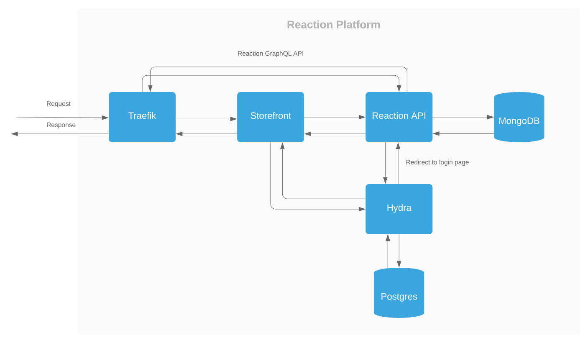
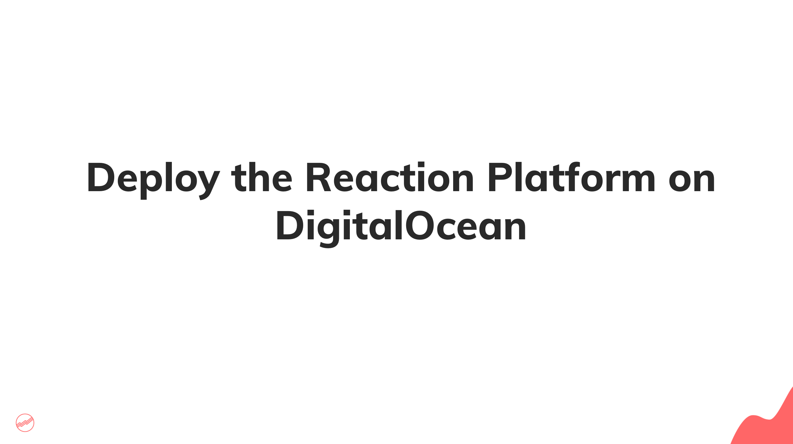

# Deploy the Reaction Platform on Digital Ocean

### Overview

This deployment guide's purpose is to provide a simple and easy guide on how to deploy the Reaction platform for evaluation purposes or small deployments. This guide is not meant to generate an enterprise production grade deployment. This deployment guide does not use Kubernetes, instead, Docker Compose is used to manage containers.

## Table of Contents
- [Requirements](#requirements)
- [Reaction Services Overview](#reaction-platform-services-overview)
- [Architecture Diagram](#architecture-diagram)
- [Getting Started](#getting-started)
- [Automated Server Configuration](#automated-server-configuration)
    - [Prepare the Remote Host](#prepare-the-remote-host)
    - [Prepare the Control Node](#prepare-the-control-node)
    - [Configure the remote host to be managed with Ansible](#configure-the-remote-host-to-be-managed-with-ansible)
    - [Generate a secure password for HTTP Basic Auth](#generate-a-secure-password-for-http-basic-auth)
    - [Set Ansible Environment Variables](#set-ansible-environment-variables)
    - [Execute the Playbook](#execute-the-playbook)
    - [Create the Primary Shop](#create-the-primary-shop)
- [Video Tutorial](#video-tutorial)
- [Command Cheatsheet](#command-cheatsheet)

### Requirements

- A Linux host with at least 2GB of RAM, this guide uses a DigitalOcean droplet
- A registered domain
- A DNS manager that supports Certification Authority Authorization (CCA) records, such as Digital Ocean
- Docker
- Docker Compose
- Git
- Node
- Yarn
- Some familiarity with [Traefik](https://github.com/containous/traefik/)

### Reaction Platform Services Overview

###### Reaction GraphQL API
The [Reaction GraphQL API](https://github.com/reactioncommerce/reaction) service provides the interface to the Reaction core functionality.

###### Storefront
The [example storefront](https://github.com/reactioncommerce/example-storefront) service provides the public facing storefront interface that customers will interact with.

###### Reaction Admin
The [Reaction Admin](https://github.com/reactioncommerce/reaction-admin) service is a Meteor(currently being migrated off Meteor) application that provides the admin UI to manage products, orders etc. 

###### Reaction Hydra
The [Reaction Hydra](https://github.com/reactioncommerce/reaction-hydra) is a OAuth2 token server that is integrated with the Reaction development platform.

###### Reaction Identity
The [Reaction Identity](https://github.com/reactioncommerce/reaction-identity) service is a Meteor application that provides authentication and authorization services.

### Architecture Diagram



## Getting Started

Reaction services will be exposed to the public using [Traefik](https://github.com/containous/traefik/), which is a cloud native router. Traefik will act as a reverse proxy that will route traffic to Docker containers. As stated above, you will need a registered domain to complete this step, as it will be necessary to manage DNS records for it.

This guide will use the following sub-domains, where `example.com` will need to be substitute it with your domain: 

| subdomain              | description                           |
| ---------------------- | ------------------------------------- |
| api.example.com        | The Reaction  GraphQL API             |
| storefront.example.com | The example storefront                |
| admin.example.com      | The Reaction admin interface          |
| hydra.example.com      | Hydra OAuth 2.0 server                |
| identity.example.com   | The Reaction Identity service         |
| traefik.example.com    | Traefik's admin UI                    |

Each of your domains will need an `A` DNS record that resolves to your host's IP. It's recommend to use DigitalOcean's free [DNS manager](https://www.digitalocean.com/docs/networking/dns/overview/). Further, in order to obtain SSL certificates for your sub-domains, you will need a DNS manager that supports [CAA](https://support.dnsimple.com/articles/caa-record/) records.


Further, you will need a [DigitalOcean Auth token](https://docs.digitalocean.com/reference/api/create-personal-access-token/) to generate CAA records for your sub-domains.


# Automated Server Configuration

In order to expedite the installation of server dependencies, Ansible will be used to automate most of the server configuration.

###### Prepare the Remote Host

In this guide a DigitalOcean node will be used to host the Reaction Platform. If you don't yet have an account, create one at [digitalocean.com](https://digitalocean.com). Once you are signed into your account, create a new droplet using the Ubuntu 18.4 image with at least 2GB of RAM. Enable DigitalOcean's [free firewall](https://www.digitalocean.com/docs/networking/firewalls/) and add inbound rules for SSH, HTTP, HTTPS and add your droplet to the firewall.

After the droplet is created either select an existing SSH key to login or click on the "New SSH Key" under the authentication section  and copy your public SSH key from your local computer.

Copy the newly created IP address and verify that you can login into the new server by executing:

```
ssh root@XXX.XXX.XXX.XXX
```

###### Prepare the Control Node

Ansible requires a control node, which is a computer that manages a remote host. This guide will assumes a Mac laptop/desktop as the control node. 

Install Ansible using [homebrew](https://brew.sh), this guide assumes some familiarity with Ansible, if you need an introduction to basic concepts click [here](https://www.ansibletutorials.com).

`brew install ansible`

Also install python3 to avoid deprecation warnings,

`brew install python3`

###### Configure the remote host to be managed with Ansible

On the control node(i.e. a developer's machine) create an inventory file in which `python3` is specified as the interpreter. On your machine, create a new file at named `hosts` at `/etc/ansible`.

Create inventory file
```
touch /etc/ansible/hosts
```

Add the following content to the inventory file:
```
[servers]
reaction.server

[servers:vars]
ansible_python_interpreter=/usr/bin/python3
[web]
```

Edit your hosts file  
```
sudo vim /etc/hosts
```

and add an entry for the DigitalOcean droplet,

```
XXX.XXX.XXX.XXX reaction.server
```

Verify that Ansible can communicate with your remote host by executing:

```
ansible all -m ping -u root
```

Your should see output similar to:

```
reaction.dev | SUCCESS => {
    "changed": false,
    "ping": "pong"
}
```

###### Set Ansible Environment Variables

Before executing the Ansible playbook, it's necessary to set variables that are specific to your deployment. Find the
`vars` section in the `reaction.yml` playbook and update as necessary, below is a list of the variable 
that need to be updated and a description of each.

| Variable               | Description                                                                 |
| ---------------------- | ----------------------------------------------------------------------------|
| do_auth_token          | The Authentication token for the Digital Ocean API                          |
| email                  | An email address to receive SSl certificate notifications                   |
| domain                 | Your registered domain                                                      |

For the rest of the variables, the default values should be used, DO NOT change otherwise, the playbook might fail.

###### Execute the playbook

Now it's time to execute the `reaction.yml` playbook, which automates most of the tedious server configuration tasks, execute the following command:

```
ansible-playbook playbooks/reaction.yml -l reaction.server
```

NOTE: the `-l reaction.server` limits the execution of the playbook to the `reaction.server` host.

###### Create the Primary Shop

At this point the Reaction GraphQL API, Example Storefront, Reaction Admin, Reaction Identity and Hydra should be accessible over the internet.

To create the primary shop login into the Reaction Admin at the following URL, first substitute the `example.com` with your actual domain:
```
https://admin.example.com
```

Upon navigating to the Reaction Admin interface, you will be presented with a login form, it will be necessary to create a user first, so click on the "Register" link and fill out the form. Once logged in, proceed to create a shop in the admin interface.

Further, the `GraphQL API` explorer will be available at `https://api.example.com/graphql`.

### Video Tutorial

[](http://www.youtube.com/watch?v=7g5LfEVLt1U "Deploy the Reaction Platform on DigitalOcean")

### Command Cheatsheet

The following bash aliases are automatically added to the remote server for convenience.

```
# Docker Compose
alias dc='docker-compose'

# Bring all services down
alias dcd='docker-compose down'

# Attach to all logs of all services
alias dcl='docker-compose logs -f'

# Run a comand inside a running container
alias dcr='docker-compose run --rm'

# "Restart" all services
alias dcre='docker-compose down && docker-compose up -d && docker-compose logs -f'

# Bring all services up in daemon mode
alias dcu='docker-compose up -d'

# Bring all containers up and attach to their logs
alias dcul='docker-compose up -d && docker-compose logs -f'

# Remove exited containers
alias dprune='docker ps -aq --no-trunc -f status=exited | xargs docker rm'

# Show all running containers, with horizontal paging
alias dps='docker ps -a | less -S'
```
